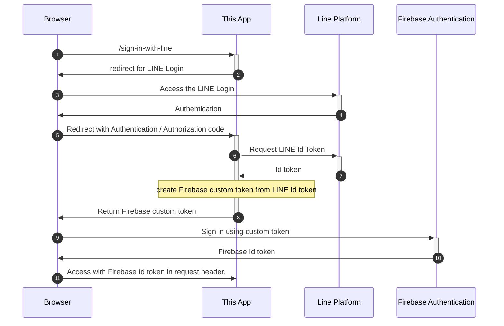

# firebase-auth-test
Sign in (LINE Login) test with Firebase Authentication, Play Framework 2.8.15 and pac4j v5.4.

# Flow

# Link
 - [Firebase Authentication](https://firebase.google.com/docs/auth?hl=ja)
 - [LINE Login v2.1](https://developers.line.biz/ja/reference/line-login/)
 - [Play Framework 2.8.15](https://www.playframework.com/documentation/2.8.x/ScalaHome)
 - [pac4j v5.4](https://www.pac4j.org/docs/index.html)

# License
MIT
